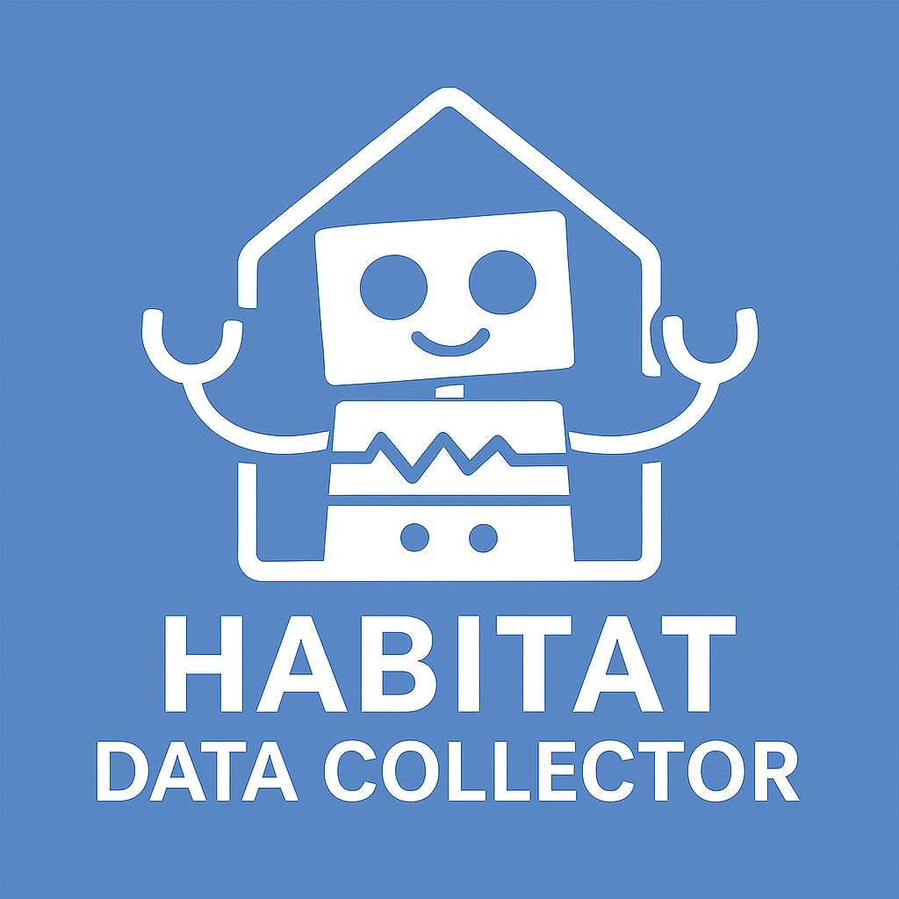

<div align="center">
  
</div>

<h1 align="center">Habitat Data Collector</h1>

<div align="center">

🚀 A modular tool for dataset collection in Habitat-Sim environments.  
📦 Part of the <a href="https://eku127.github.io/DualMap/">DualMap</a> project.

</div>


## ✨ Features

- ✅ Customize dynamic scenes and object layouts  
- 📡 Stream ROS2 data (pose, RGB-D)  
- 💾 Record and evaluate data for perception/navigation tasks
- 🎯 Support both timestamp-based and action-based data saving modes


## 📚 Table of Contents

- [Environment Setup](#-environment-setup)
- [Dataset Setup](#-dataset-setup)
- [Configuration Guide](#️-configuration-guide)
- [Run the Collector](#-run-the-collector)
  - [ROS2 Integration (Optional)](#-ros2-integration-optional)
- [User Guide](#-user-guide)
- [Project Structure](#-project-structure)
- [Acknowledgment](#-acknowledgment)


## 📦 Environment Setup

> 🖥️ This setup is tested on **Ubuntu 22.04** with **Python 3.10**.

### 1. Clone the repository with submodules

```bash
git clone --recurse-submodules https://github.com/Eku127/habitat-data-collector.git
cd habitat-data-collector
```

### 2. Create the Conda environment

```bash
conda env create -f environment.yml
conda activate habitat_data_collector
```

### 3. Build and install Habitat Sim & Lab

> This step will take some time as it compiles Habitat-Sim from source.
> Habitat cannot be installed by conda in Python 3.10, so it must be built manually.

```bash
bash scripts/install_habitat.sh
```

> During compiling with habitat-sim, if having error with OgenGL, like `Could NOT find OpenGL` and errors with compiling `zlib_external`, install the required libs by:
>```bash
> sudo apt install libgl1-mesa-dev libglu1-mesa-dev freeglut3-dev zlib1g-dev
>```

### 🐳 Docker Setup
As an alternative to Conda, you can also build an environment with Docker. Instead of steps 2 and 3 above you can build a Docker image using the provided compose file:

```bash
docker compose -f docker/compose.yml build
```

this will build an image called ```habitat-data-collector``` that has Cuda support and installs ```habitat-sim``` as well as ```habitat-lab``` from source.

Once the build has completed you can launch a container with the same compose file:

```bash
docker compose -f docker/compose.yml up -d
```

and open an interactive shell:

```bash
docker exec -it <name-of-container> bash
```

### 🐳 Docker + 🐢 ROS2 Setup
If you also want to use the ROS2 functionalities of this repo while running everything in Docker, there is an additional Dockerfile that builds ROS humble on top of the Docker image outlined above. The setup process is similar:

Build the image:

```bash
docker compose -f docker/compose.humble.yml build
```

Start a container:

```bash
docker compose -f docker/compose.humble.yml up -d
```

and open an interactive shell:

```bash
docker exec -it <name-of-container> bash
```


## 📦 Dataset Setup

Before running the tool, please follow the [dataset setup guide](documents/dataset/dataset.md) to prepare the required datasets.

For a Docker-based HM3D setup, copy `.env.example` to `.env`, add your
Matterport API token, and run:

```bash
# Installs the non-008xx training scenes and the validation scenes.
scripts/download_hm3d.sh train val

# Discover and launch any installed scene.
scripts/list_hm3d_scenes.sh train
scripts/run_hm3d.sh 00006-HkseAnWCgqk train

# Optional, but required by the add/grab/place object controls.
scripts/download_ycb.sh
```

The launcher accepts either the full scene-folder name or its Matterport hash.
Run `scripts/download_hm3d.sh minival` for a much smaller 10-scene smoke-test
installation. Credentials in `.env` and all data under `data/` are ignored by
Git.


## ⚙️ Configuration Guide

For a detailed explanation of configuration options and structure, please refer to the [Configuration Reference](documents/config_reference/config_reference.md). Setting up correct configs is crucial for running this tool.

### Save Mode Configuration

The collector supports two data saving modes:

- **`timestamp`**: Saves every frame during recording (original behavior)
- **`action`**: Saves only when an action is executed (one frame per action)

Configure in `config/habitat_data_collector.yaml`:
```yaml
save_mode: action  # or "timestamp"
```


## 🚀 Run the Collector

Run the main simulation from the root directory:

```bash
python -m habitat_data_collector.main
```

By default, it uses the configuration file at: `config/habitat_data_collector.yaml`. For config details, refer to the [Config Reference](documents/config_reference/config_reference.md).

### ROS2 Integration (Optional)

If you want to receive and send ROS2 topic outputs or record ROS2 bags:

1. Install **ROS2 Humble** following the [official guide](https://docs.ros.org/en/humble/Installation/Ubuntu-Install-Debians.html).
2. Source the ROS2 environment before running the collector:

```bash
source /opt/ros/humble/setup.bash  # or setup.zsh
```

Once sourced, the simulator will publish data to ROS2 topics. You can record them by enabling the ROS recording configuration in `config/habitat_data_collector.yaml`. See the [ROS Integration Documentation](documents/ros.md) for topic configuration and ROS2-to-ROS1 bridge setup.


## 📘 User Guide

**Once the simulator launches successfully, refer to the [Usage Guide](documents/usage/usage.md) to learn how to**:

- Move the camera and explore the scene
- Add, place, grab, and delete objects
- Start and stop recording (raw data + ROS2 bag)
- Save and reload a scene configuration

The guide includes visual previews and terminal output samples for better understanding.

### DualMap Scene Layout Authoring

To author DualMap-style static and dynamic object layouts, see the
[authoring mode guide](documents/dualmap_authoring/README.md) for the
interactive workflow, or
[automated dataset authoring](documents/dualmap_authoring/automated_dataset.md)
to generate whole multi-scene datasets headlessly:

```bash
xvfb-run -a python scripts/auto_dualmap_authoring.py --split val scan \
  --report outputs/dualmap_authoring/scan_val.json
xvfb-run -a python scripts/auto_dualmap_authoring.py --split val build \
  --from-scan outputs/dualmap_authoring/scan_val.json --count 15
```


## 📁 Project Structure

```
habitat-data-collector/
├── habitat_data_collector/       # Main application code
│   ├── main.py                   # Entry point
│   ├── app.py                    # Application class
│   ├── config/                   # Configuration constants
│   │   └── settings.py
│   ├── core/                     # Core modules
│   │   ├── state_manager.py      # Centralized state management
│   │   ├── event_dispatcher.py   # Event-driven architecture
│   │   └── simulator_service.py  # Habitat-Sim wrapper
│   ├── handlers/                 # Action handlers
│   │   ├── input_handler.py      # Keyboard input
│   │   ├── recording_handler.py  # Recording/playback
│   │   ├── navigation_handler.py # Navigation control
│   │   └── object_handler.py     # Object manipulation
│   ├── services/                 # Service layer
│   │   ├── data_saver.py         # Data saving (timestamp/action modes)
│   │   └── visualizer.py         # Visualization
│   ├── adapters/                 # External integrations
│   │   └── ros_adapter.py        # ROS2 integration
│   └── utils/                    # Utility functions
│       ├── coordinate_transform.py
│       ├── config_factory.py
│       ├── topdown_map.py
│       └── scene_utils.py
├── config/                       # YAML configuration files
├── 3rdparty/                     # Git submodules: habitat-sim & habitat-lab
├── documents/                    # Markdown documentation and media
├── scripts/                      # Helper scripts (e.g. build, setup)
├── environment.yml               # Conda environment spec
└── README.md
```


## ⚠️ Notes

- ROS2 Humble must be installed and sourced before using ROS features.
- Configurations are handled with [OmegaConf](https://omegaconf.readthedocs.io/) and [Hydra](https://hydra.cc/).
- All paths, topics, and behaviors are configured in `config/habitat_data_collector.yaml`.

## 🔗 Citation

If you find our work helpful, please consider starring this repo 🌟 and cite:

```bibtex
@article{jiang2025dualmap,
  title={DualMap: Online Open-Vocabulary Semantic Mapping for Natural Language Navigation in Dynamic Changing Scenes},
  author={Jiang, Jiajun and Zhu, Yiming and Wu, Zirui and Song, Jie},
  journal={arXiv preprint arXiv:2506.01950},
  year={2025}
}
``` 

## 🙏 Acknowledgment

This project builds on the outstanding work of:

- [Habitat-Sim](https://github.com/facebookresearch/habitat-sim) 
- [Habitat-Lab](https://github.com/facebookresearch/habitat-lab) 

We thank the authors and contributors of these projects for making them open-source and actively maintained.


This project is also inspired by the data collection pipeline from [VLMaps](https://github.com/vlmaps/vlmaps), and we are grateful to the authors of both [HOVSG](https://github.com/hovsg/HOV-SG) and [VLMaps](https://github.com/vlmaps/vlmaps) for their contributions.

Special thanks to @[TOM-Huang](https://github.com/Tom-Huang) and @[aclegg3](https://github.com/aclegg3) for valuable advice and support during development.

## 📜 License

MIT License
